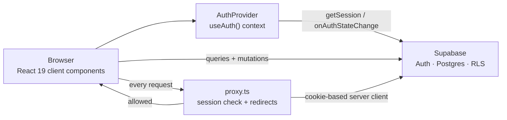

<div align="center">


### Connect. Learn. Grow Together.

A peer-to-peer platform where high school students find tutors, offer their expertise,
and discover extracurricular activities — all in one feed.

[](https://nextjs.org)
[](https://react.dev)
[](https://www.typescriptlang.org)
[](https://tailwindcss.com)
[](https://supabase.com)

</div>

---

## What is Atria?

Most tutoring at a high school happens through word of mouth — a junior who's good at
chemistry, a sophomore who needs help, and no reliable way for the two to find each other.
Atria makes that connection explicit.

Sign up, and your **role determines what you can post**:

| Who you are | What you post | Feed label |
| --- | --- | --- |
| Freshman / Sophomore | A request for help in specific subjects | 🔵 Requesting Help |
| Junior / Senior | An offer to tutor in subjects you know | 🟢 Offering Help |
| Extracurricular host | An activity or club with a date | 🟣 Activity |

There's no "choose a post type" dropdown — the app infers it from your account type and
year at post time. One less decision, and the feed stays honest.

## Features

- **Role-aware posting** — post type is derived from `account_type` + `year`, never self-declared
- **Unified community feed** — every post in one place, filterable by type
- **Public profiles** — `/account/<username>` shows a user's posts, year, and contact info
- **Own-post management** — delete your own posts inline from your profile
- **Email/password auth** — Supabase Auth with cookie-based sessions that work server-side
- **Route protection at the edge** — unauthenticated visitors are bounced to `/auth` before a page ever renders
- **Row Level Security everywhere** — the database enforces ownership, not just the UI
- **Account self-deletion** — a `security definer` RPC cascades the user's auth record, profile, and posts
- **Themeable in four lines** — the entire palette lives in four CSS variables

## Tech Stack

| Layer | Choice |
| --- | --- |
| Framework | Next.js 16 (App Router, Turbopack dev) |
| UI | React 19, Tailwind CSS v4, Radix primitives, `lucide-react` |
| Language | TypeScript 5 (strict) |
| Auth & data | Supabase — Postgres, Auth, Row Level Security |
| Session bridge | `@supabase/ssr` (browser client + proxy-level server client) |
| Hosting | Vercel-ready |

## Getting Started

### Prerequisites

- Node.js 20+
- A [Supabase](https://supabase.com) project (the free tier is plenty)

### 1. Install

```bash
git clone https://github.com/DD10654/atria.git
cd atria
npm install
```

### 2. Configure environment

Create a `.env.local` in the project root:

```bash
NEXT_PUBLIC_SUPABASE_URL=https://<your-project-ref>.supabase.co
NEXT_PUBLIC_SUPABASE_ANON_KEY=<your-anon-key>
```

Both are found in your Supabase dashboard under **Project Settings → API**. The app throws
on boot if either is missing, so you'll know immediately.

> `.env*` is gitignored. Only the anon key is used client-side — it's safe to ship because
> every table is protected by RLS.

### 3. Set up the database

Apply the migration in `supabase/migrations/` using either approach:

```bash
# Option A — Supabase CLI (recommended)
supabase link --project-ref <your-project-ref>
supabase db push
```

Or **Option B**: open the Supabase dashboard → **SQL Editor**, paste the contents of
`supabase/migrations/20260127000000_remote_schema.sql`, and run it. The migration is written
to be re-runnable — it drops and recreates policies rather than erroring on conflicts.

### 4. Run

```bash
npm run dev
```

Open [http://localhost:3000](http://localhost:3000).

> **Tip:** Supabase requires email confirmation by default, so signup will park you on a
> "check your email" screen. For local development, turn off **Confirm email** under
> **Authentication → Providers → Email** to get a session immediately.

### Scripts

| Command | Does |
| --- | --- |
| `npm run dev` | Start the dev server |
| `npm run build` | Production build |
| `npm start` | Serve the production build |
| `npm run lint` | ESLint (`eslint-config-next`) |

## Project Structure

```
atria/
├── app/
│   ├── layout.tsx           # Root layout — fonts + AuthProvider
│   ├── page.tsx             # Public landing page
│   ├── globals.css          # Tailwind v4 theme + brand tokens
│   ├── auth/                # Combined sign in / sign up
│   ├── home/                # Community feed with type filter
│   ├── post/                # Create a post (form adapts to your role)
│   ├── account/[id]/        # Public profile — accepts a UUID or a username
│   └── settings/            # Update username, delete account
├── components/
│   ├── Navbar.tsx           # Sticky nav, auth-aware, with mobile menu
│   └── PostCard.tsx         # Feed item — badge, subjects, event date
├── context/
│   └── auth-context.tsx     # useAuth() — session state + onAuthStateChange
├── utils/supabase.ts        # Browser Supabase client
├── lib/utils.ts             # cn() class merger
├── proxy.ts                 # Route protection (Next.js 16's middleware)
└── supabase/migrations/     # Schema, RLS policies, triggers, RPCs
```

### A note on `proxy.ts`

Next.js 16 renamed `middleware.ts` to `proxy.ts` (exporting `proxy` instead of `middleware`).
That file is where auth routing is enforced:

- No session + requesting anything other than `/` or `/auth` → redirect to `/auth`
- Has a session + requesting `/auth` → redirect to `/home`

Because it runs before rendering, protected pages never flash unauthenticated content. Static
assets and images are excluded via the `config.matcher` regex.

## Architecture



Sessions live in cookies via `@supabase/ssr`, which is what lets `proxy.ts` read auth state
on the server while `AuthProvider` keeps the client in sync through `onAuthStateChange`.

## Data Model

**`users`** — mirrors `auth.users`, populated automatically by an `on_auth_user_created` trigger
that reads signup metadata.

| Column | Notes |
| --- | --- |
| `id` | PK, FK → `auth.users`, cascades on delete |
| `email` | |
| `account_type` | `student` \| `extracurricular_host` |
| `year` | `freshman` \| `sophomore` \| `junior` \| `senior` — null for hosts |
| `username` | unique |
| `phone_number` | how people reach you |

**`posts`**

| Column | Notes |
| --- | --- |
| `id` | PK, `uuid_generate_v4()` |
| `user_id` | FK → `users`, cascades on delete |
| `post_type` | `tutor_request` \| `tutor_offer` \| `extracurricular` |
| `description` | capped at 500 characters by a DB check constraint |
| `subjects` | `text[]` — tutoring posts only |
| `date` | extracurriculars only |

### Security policies

Both tables have RLS enabled. Profiles and posts are publicly readable; writes are locked down:

- Insert a profile only where `auth.uid() = id`
- Update only your own profile
- Insert posts only when authenticated
- Delete only posts where `auth.uid() = user_id`

Account deletion runs through `public.delete_own_user()`, a `security definer` function —
users can't delete their own `auth.users` row directly, so the function removes posts,
profile, and auth record in order.

## Theming

The whole palette is four variables at the top of `app/globals.css`:

```css
:root {
  --brand-accent: #ffe6b4;  /* buttons, highlights, focus rings */
  --brand-text:   #545454;  /* default text */
  --brand-bg:     #ffffff;  /* surfaces and cards */
  --brand-bg-alt: #f9fafb;  /* page background */
}
```

Tailwind v4 exposes them as `bg-brand-accent`, `text-brand-text`, and friends through the
`@theme inline` block. Change the hex values and the entire app follows.

## Deployment

The app deploys to Vercel with no configuration beyond environment variables:

1. Import the repo at [vercel.com/new](https://vercel.com/new)
2. Add `NEXT_PUBLIC_SUPABASE_URL` and `NEXT_PUBLIC_SUPABASE_ANON_KEY`
3. Deploy

Then add your production domain to Supabase under **Authentication → URL Configuration** so
email confirmation links resolve correctly.

## Roadmap

Honest list of what's stubbed or missing:

- [ ] Password reset — the settings button currently explains the flow instead of sending the email
- [ ] Confirmation dialog before account deletion
- [ ] Editing posts (the schema intentionally has no update policy yet)
- [ ] Search and subject-based filtering in the feed
- [ ] Generated Supabase types to replace the remaining `any` in page components
- [ ] In-app messaging so contact isn't limited to a phone number
- [ ] Test suite

## Contributing

Issues and pull requests are welcome. Please run `npm run lint` and confirm `npm run build`
passes before opening a PR.

---

<div align="center">
<sub>Built with Next.js and Supabase.</sub>
</div>
